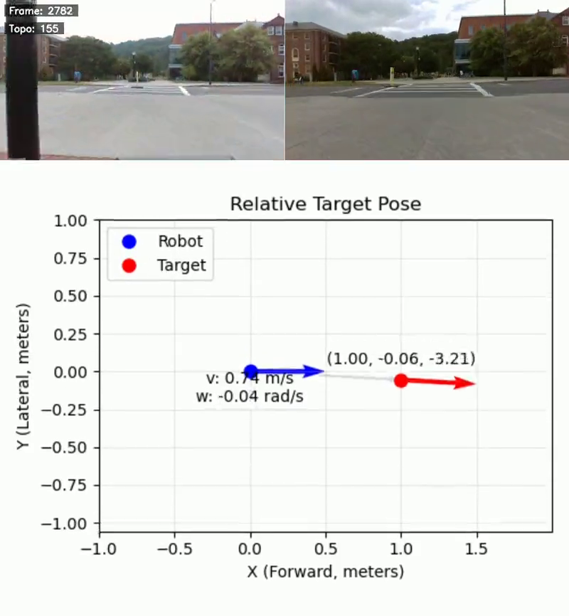

# GuideNav: Visual Teach-and-Repeat Navigation using Topological Mapping

<p align="center">
  <a href="assets/teaser.mp4">
    
  </a>
</p>

<!-- To embed video: drag-drop teaser.mp4 into GitHub issue/PR, then paste the generated link here -->

<p align="center">
  <a href="https://arxiv.org/abs/2512.06147"></a>
  <a href="https://guidedogrobot-navigation.github.io/"></a>
  <a href="LICENSE"></a>
</p>

This repository contains the official implementation of **GuideNav**, a visual teach-and-repeat navigation system that enables autonomous robot navigation using RGB images and topological mapping.

## Overview

GuideNav is an **RGB-only**, **untethered** visual navigation system designed for autonomous robot deployment. The system learns navigation routes from demonstration and can reliably repeat them using visual place recognition and relative pose estimation.

### Key Features

- **RGB-only Navigation**: No depth sensors or LiDAR required during deployment
- **Topological Mapping**: Efficient sparse map representation using keyframes
- **Place Recognition**: Robust localization using state-of-the-art visual place recognition models
- **Real-time Performance**: Optimized for edge deployment on NVIDIA Jetson platforms
- **Multiple Feature Matching Methods**: Support for LoFTR, RoMa, MAST3R, LiftFeat, and Reloc3r

## Installation

### Prerequisites

- Ubuntu 20.04 / 22.04
- Python 3.8+
- CUDA 11.x or 12.x
- ROS2 Humble (for robot deployment)

### Setup

1. Clone the repository:
```bash
git clone https://github.com/YOUR_USERNAME/GuideNav.git
cd GuideNav
```

2. Create a conda environment:
```bash
conda create -n guidenav python=3.10
conda activate guidenav
```

3. Install dependencies:
```bash
pip install -r requirements.txt
```

4. Download model weights:
```bash
# Place recognition models
mkdir -p model_weights
# Download CosPlace weights from: https://github.com/gmberton/CosPlace
# Download feature matching weights as needed
```

## Usage

### 1. Build a Topological Map (Teaching Phase)

First, collect images along the desired route:

```bash
# Record RGB-D data with odometry
python sensor/extract_data_two.py --output-dir ./data/teaching_run

# Build topological map from recorded data
python sensor/build_topomap.py ./data/teaching_run ./data/topomap --distance 1.0
```

For adaptive keyframe selection using visual features:
```bash
python topogen/gen_dinov3.py --input ./data/raw_images --output ./data/topomap
```

### 2. Extract Place Recognition Features

```bash
# Features are automatically extracted on first navigation run
# Or pre-compute them:
python -m guidenav.place_recognition.extract_database --topomap-dir ./data/topomap
```

### 3. Navigation (Repeat Phase)

For real-time navigation with ROS2:
```bash
python guidenav/navigate.py \
    --robot mc \
    --robot-config-path ./config/robots.yaml \
    --topomap-base-dir ./data \
    -d topomap \
    --model-weight-dir ./model_weights \
    --model-config-path ./config/models.yaml \
    --feature-matching reloc3r
```

For offline testing with recorded images:
```bash
python guidenav/navigate.py \
    --offline-images \
    --img-dir ./data/test_run/color \
    --topomap-base-dir ./data \
    -d topomap \
    --feature-matching reloc3r
```

## Configuration

### Robot Configuration (`config/robots.yaml`)

Configure robot-specific parameters including:
- Maximum linear/angular velocities
- Camera intrinsics
- Control parameters

### Model Configuration (`config/models.yaml`)

Configure place recognition models:
- CosPlace
- SelAvPR

## Project Structure

```
GuideNav/
├── guidenav/               # Core navigation system
│   ├── navigate.py         # Main navigation node
│   ├── parser.py           # Argument parser
│   ├── match_to_control/   # Feature matching and control
│   │   ├── feature_match.py
│   │   ├── control.py
│   │   └── se2_estimate.py
│   ├── models/             # Neural network models
│   │   └── pr_models/      # Place recognition models
│   └── place_recognition/  # VPR filtering modules
├── sensor/                 # Data collection tools
├── topogen/               # Topological map generation
├── config/                # Configuration files
└── model_weights/         # Model checkpoints (not included)
```

## Citation

If you find this work useful, please cite our paper:

```bibtex
@article{hwang2025guidenav,
  title={GuideNav: User-Informed Development of a Vision-Only Robotic Navigation Assistant For Blind Travelers},
  author={Hwang, Hochul and Yang, Soowan and Monon, Jahir Sadik and Giudice, Nicholas A and Lee, Sunghoon Ivan and Biswas, Joydeep and Kim, Donghyun},
  journal={arXiv preprint arXiv:2512.06147},
  year={2025}
}
```

## Acknowledgments

We would like to thank the authors and contributors of the following projects:

- [PlaceNav](https://github.com/lasuomela/PlaceNav) - Bayesian filtering for visual navigation
- [CosPlace](https://github.com/gmberton/CosPlace) - Visual place recognition
- [visualnav-transformer](https://github.com/robodhruv/visualnav-transformer) - Visual navigation framework
- [LoFTR](https://github.com/zju3dv/LoFTR) - Local feature matching
- [RoMa](https://github.com/Parskatt/RoMa) - Robust dense feature matching
- [MAST3R](https://github.com/naver/mast3r) - 3D reconstruction and matching
- [Reloc3r](https://github.com/ffrivera0/reloc3r) - Relative pose estimation

Parts of the place recognition filtering code are adapted from [PlaceNav](https://github.com/lasuomela/PlaceNav) (MIT License).

Parts of the feature extraction code are adapted from [hloc](https://github.com/cvg/Hierarchical-Localization) by Paul-Edouard Sarlin et al. (Apache-2.0 License).

## License

This project is released under the MIT License. See [LICENSE](LICENSE) for details.
